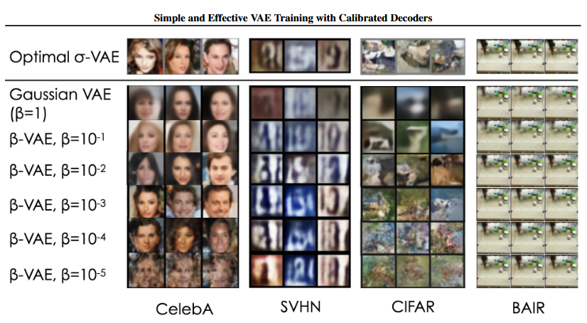

# Streamlit App on Variational AutoEncoders

[](https://www.python.org/)
[](https://pytorch.org/)
[](https://streamlit.io/)

Ce projet implémente différentes variantes d'Autoencodeurs Variationnels (VAEs) avec une interface utilisateur Streamlit permettant de découvrir les VAEs en modifiant facilement les hyperparamètres.

 


## 📋 Table des Matières

- [Introduction](#-introduction)
- [Modèles Implémentés](#-modèles-implémentés)
- [Résultats](#-résultats)
- [Installation](#-installation-avec-conda)
- [Utilisation](#-utilisation)
- [Structure du Projet](#-structure-du-projet)
- [Aspects Techniques](#-aspects-techniques)
- [Contributions](#-contributions)
- [Références](#-références)

## 🔍 Introduction

Un Variational Autoencoder (VAE) est un modèle génératif, c'est-à-dire qu'il permet de créer des images, du texte, de la musique, etc. Nous nous concentrerons uniquement sur la génération d'images, bien que les VAEs aient d'autres applications.

Les VAEs sont dérivés des auto-encodeurs, qui compressent des images pour les représenter dans un espace de plus basse dimension : c'est le rôle de l'encodeur. Ensuite, cette représentation latente est décompressée pour reconstituer l'image originale : c'est le rôle du décodeur. Les auto-encodeurs sont utilisés quotidiennement pour envoyer des images et du son, avec pour objectif de récupérer exactement ce qui a été envoyé.

C'est ici que les VAEs se distinguent. Contrairement aux auto-encodeurs classiques, les VAEs ne sont pas déterministes. Ils permettent, à partir d'une même représentation latente, de générer des images variées. L'encodeur ne fournit plus une représentation latente fixe, mais une distribution probabiliste de cette représentation.

## 🧠 Modèles Implémentés

### VAE original
- VAE avec encodeur et décodeur gaussien
- Implémentation basée sur l'article ["Auto-Encoding Variational Bayes"](https://arxiv.org/abs/1312.6114)

### β-VAE 
- Introduit un poids β dans la fonction de perte pour ajuster l'importance relative des deux termes
- Basé sur l'article ["beta-VAE: Learning Basic Visual Concepts with a Constrained Variational Framework"](https://openreview.net/forum?id=Sy2fzU9gl)

### σ-VAE
- Calcule analytiquement la variance des données σ et l'utilise dans la perte de reconstruction, qui est cette fois-ci une log-vraisemblance
- Implémentation selon l'article ["Simple and Effective VAE Training with Calibrated Decoders"](https://orybkin.github.io/sigma-vae/)


## 💥 Résultats

Pour avoir une idée des images que vous pouvez obtenir voici les résutats d'un comparatif publié par Oleh Rybkin dans ["Simple and Effective VAE Training with Calibrated Decoders"](https://arxiv.org/pdf/2006.13202).



## 💻 Installation (avec conda)

```bash 
# Cloner le repository
git clone https://github.com/grAmine03/Master-2-Variational-Auto-Encoder
cd VAEs

# Créer et activer un environnement virtuel (optionnel)
conda create --name nom_de_l_environnement
conda activate nom_de_l_environnement

# Installer les dépendances
pip install -r requirements.txt
```

## 🚀 Utilisation

Pour lancer l'application Streamlit:

```bash
streamlit run app.py
```

L'application s'ouvrira dans votre navigateur et vous pourrez en lire davantage sur les VAEs et explorer les 3 architectures implémentées.

## 📁 Structure du Projet

```
VAEs/
├── app.py                  # Application Streamlit
├── requirements.txt        # Dépendances du projet
├── bvae.py                 # Implémentation de BetaVAE
├── svae.py                 # Implémentation de SigmaVAE
├── train.py                # Module pour l'entraînement
├── utils.py                # Module pour récuperer les données et enregistrer les modèles
├── viz.py                  # Module pour les visualisations et les figures
├── models/                 # Modèles et pertes enregistrer en .pth
├── img/                    # Images pour l'application
├── docs/                   # Documentation Sphinx
├── Readme.md
```

## 🔧 Aspects Techniques

### Import des données

Les données MNIST et CIFAR-10 sont téléchargées directement vers un dossier `data/` depuis le module `torchvision.datasets`. Avant de les utilisées dans nos modèles, les données sont standardisées.

### Architecture des modèles

Les modèles sont construits comme des classe héritant de `nn.Module`. Ils contiennent plusieurs méthodes : 
- encode
- reparametrize
- decode
- forward
- loss_function
- sample 

Le VAE original est un BetaVAE avec `beta = 1`

### Entraînement

L'entraînement utilise une fonction de perte composé d'un perte de reconstruction et d'une KL-divergence. La perte de reconstruction est une erreur quadratique (MSE et L1 error) ou bien une log-vraissemblance (gaussienne et laplacienne) pour SigmaVAE.

Le tout est optimisé avec Adam pour un learning_rate optimisé à `1e-3`.

## Documentation avec Sphinx

Ce projet utilise Sphinx pour générer une documentation complète et navigable. Voici comment configurer, créer et compiler la documentation.

### Installation de Sphinx

Pour installer Sphinx et les extensions nécessaires, exécutez :

```bash
pip install sphinx sphinx-rtd-theme autodoc numpydoc
```

### Structure de la documentation

La documentation est organisée dans le dossier `docs/` avec la structure suivante :

```
docs/
├── source/
│   ├── _static/
│   ├── _templates/
│   ├── api/
│   ├── tutorials/
│   ├── conf.py
│   ├── index.rst
│   └── ...
├── Makefile
└── make.bat
```

### Génération de la documentation

Pour générer la documentation automatiquement :

```bash
cd docs
make html
```

Vous trouverez ensuite la documentation HTML dans `docs/build/html/`.

## 🤝 Contributions

Les contributions sont les bienvenues! Pour contribuer:
1. Forkez le repository
2. Créez une branche pour votre fonctionnalité (`git checkout -b feature/nouvelle-fonctionnalite`)
3. Committez vos changements (`git commit -m 'Ajout d'une nouvelle fonctionnalité'`)
4. Poussez vers la branche (`git push origin feature/nouvelle-fonctionnalite`)
5. Ouvrez une Pull Request

## 📚 Références

- [Auto-Encoding Variational Bayes](https://arxiv.org/abs/1312.6114)
- [beta-VAE: Learning Basic Visual Concepts with a Constrained Variational Framework](https://openreview.net/forum?id=Sy2fzU9gl)
- [Simple and Effective VAE Training with Calibrated Decoders](https://orybkin.github.io/sigma-vae/)


